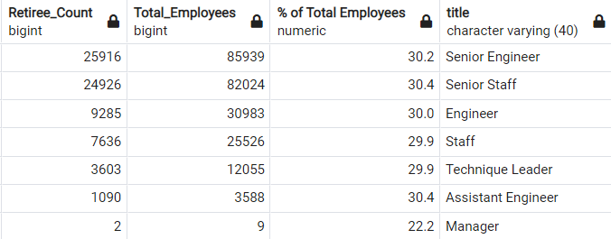
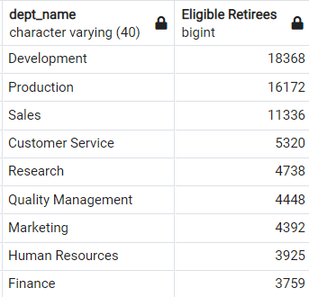
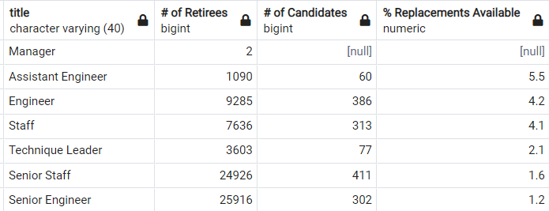
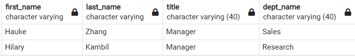
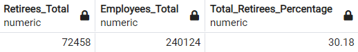
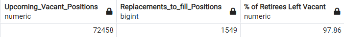
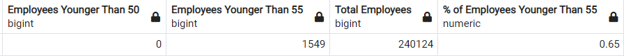

# Pewlett-Hackard-Analysis

## ***Overview of the analysis:***
<!-- Overview of the analysis: Explain the purpose of this analysis. -->
The company Pewlett-Hackard requires data to prepare for an upcoming surge of retirements from its employees. This analysis serves to identify the amount of employees eligible for retirement per department. This analysis also identifies employees who are still 5+ years from retirement that would be eligible for a mentorship program to succeed the retirees.

### Resources Used
* Entity-Relationship Diagram: 'ERD/EmployeeDB.png.png'
    * Departments file: 'Starting_Data/departments.csv'
    * Dept_Emp file: 'Starting_Data/dept_emp.csv'
    * Dept_Manager file: 'Starting_Data/dept_manager.csv'
    * Employees file: 'Starting_Data/employees.csv'
    * Salaries file: 'Starting_Data/salaries.csv'
    * Titles file: 'Starting_Data/titles.csv'
* SQL Query Program: pgAdmin 4 V.6.8

<!-- Results: Provide a bulleted list with four major points from the two analysis deliverables. Use images as support where needed. -->
## ***Results***
### Roles to Fill
* The most urgent roles to fill are Senior Engineers and Senior Staff members. Both of these positions have over 20,000 employees eligible for retirement as can be seen in the csv file linked below. Almost every position needs approximately 30% of its employees to be replaced. Although the position of Manager has the lowest amount of openings (only 2 retirees), it is also a top priority to find replacements for these administrative positions.

**FIG 1: The number of Retirees grouped by Roles**

### Department Needs
* The departments needing the most new employees are Development, Production, and Sales which all need over 10,000 new employees. The departments needing the least new employees are Human Resources and Finance which both need under 4,000 new employees.

**FIG 2: The number of Retirees grouped by Departments**

### Mentorship Program Practicality
* Currently none of the departments have anywhere close to the personnel needed to replace their retiring employees. Engineer positions seem the most able to replace their retirees, but even the most equipped position (Assistant Engineers) only has 5.5% of the necessary employees needed to fill the soon to be empty positions.

**FIG 3: The ratio of Retiring Employees to Candidates eligible for the Mentorship Program**

### Managers to Replace
* The departments which will need new managers are Sales and Research. The managers of those departments who will be retiring are Zhang, Hauke and Kambil, Hilary.

**FIG 4: The Managers eligible for retirement**

<!-- Summary: Provide high-level responses to the following questions, then provide two additional queries or tables that may provide more insight into the upcoming "silver tsunami."
How many roles will need to be filled as the "silver tsunami" begins to make an impact?
Are there enough qualified, retirement-ready employees in the departments to mentor the next generation of Pewlett Hackard employees? -->
## ***Summary***
### Roles to Replace
As seen in the data above, there are approximately 72,500 employees eligible for retirement in the year 2020. This means 30% of current employees will need to be replaced. Currently there are 1,549 employees eligible for the mentorship program intended to transition current employees into these soon-to-be vacant roles. This means that approximately 98% of the roles will still be vacant until Pewlett-Hackard begins to hire new employees into the company.

**FIG 5: All employees eligible for retirement, split by departments.**

**FIG 6: Data pairing retiring employees against available replacements from mentorship program.**

### The Need to Diversify Hiring Practices
One of the most crucial steps that Pewlett-Hackard needs to take is hiring employees from later generations. While there is value in having experienced employees, it is crucial for a business to diversify its workforce. Unfortunately the data below shows that P-H has not yet taken the steps to diversify its workforce. 

**FIG 7: The percentage of current employees in certain age groups.**

As can be seen in the values above, currently there is less than 1% of the workforce that is younger than 55 years of age. And even more shockingly, there are 0 employees younger than 50 years of age. This lack of foresight needs to be fixed immediately if the company wishes to last longer than 10 more years, when its youngest current employees turn 65 and in turn become eligible for retirement. At that point there will be 0 employees left at the company unless current hiring practices are significantly modified.